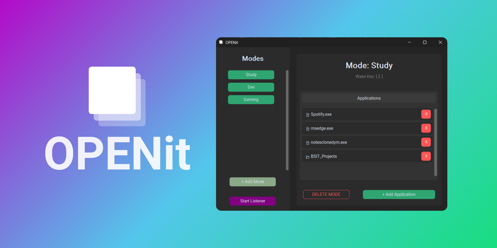

# ⬜ OPENit - Launch everything with a quick key sequence! ⬜

OPENit is a desktop automation tool built for students, developers, and gamers who hate the repetitive process of opening the same 5 applications every time they sit down. 

Instead of clicking icons one by one, define a **Mode** (e.g., "Study", "Game", "Work") and launch everything with a quick key sequence.

### 🍀 Authors 🍃
- [@DymNomZ](https://github.com/DymNomZ) - Backend Logic & Linux Support
- [@morel-porel](https://github.com/morel-porel) - **Tool Idea**, UI/UX Design & Windows Testing

## ✨ Features

- **📂 Universal Launcher:** Opens Executables (`.exe`), Directories/Folders, PDFs, Text files, and more.
- **🛡️ Smart "Wake Key" System:** 
  - Prevents accidental triggers while typing.
  - Press **`Ctrl + Space`** to wake the bot -> Press your **Trigger Key** (e.g., `s`) -> Watch your apps load.
- **🎨 Modern UI:** A clean, dark-themed interface built with [`CustomTkinter`](https://github.com/TomSchimansky/CustomTkinter).
- **👻 Background Listening:**
  - **Windows:** Minimizes to the System Tray.
  - **Linux:** Minimizes to Taskbar.
- **💾 Auto-Save:** Configurations are saved in JSON format to your `Documents/OPENitModes` folder.
- **🐧🪟 Cross-Platform:** Developed and tested on **Windows 11** and **Linux Mint**.

## 📥 Installation

Go to the [Releases Page](https://github.com/morel-porel/OPENit/releases).

### Windows
1. Download `OpenIt.exe`.
2. Right-click the file -> **Properties** -> **Compatibility** -> Check **"Run as Administrator"** (Required for global hotkey listening).
3. Double-click to run.

### Linux
1. Download the Linux binary (the one with no '.exe').
2. Make it executable: `chmod +x OpenIt`
3. Run via terminal or create a `.desktop` shortcut.

## 🎮 Usage Guide

1. **Create a Mode:** Click `+ Add Mode`. Give it a name (e.g., "Gaming") and a single letter key (e.g., `g`).
2. **Add Resources:** Click your new mode, then click `+ Add Application`. You can select files or entire Folders.
3. **Start Listening:** Click the red **START LISTENER** button.
4. **Trigger it:**
   - Press **`Ctrl + Space`** (The Wake Key).
   - Immediately press **`g`** (Your Mode Key).
   - **OPENit** will launch all the assigned applications.

## 🛠️ Built With


*   **Language:** Python 3.12
*   **GUI:** [CustomTkinter](https://github.com/TomSchimansky/CustomTkinter)
*   **Logic:** `keyboard` (Global Hooks), `subprocess`, `threading`
*   **System Tray:** `pystray`, `Pillow`
*   **Packaging:** PyInstaller

## 🧑‍💻 Development Setup

If you want to run the source code directly:

```bash
# Clone the repo
git clone https://github.com/YourUsername/OPENit.git
cd OPENit

# Install dependencies
pip install -r requirements.txt
# (Make sure to install customtkinter, keyboard, pystray, pillow)

# Run the App
# Windows (CMD/PowerShell)
python gui.py

# Linux (Requires Root for keyboard hook)
sudo python gui.py
